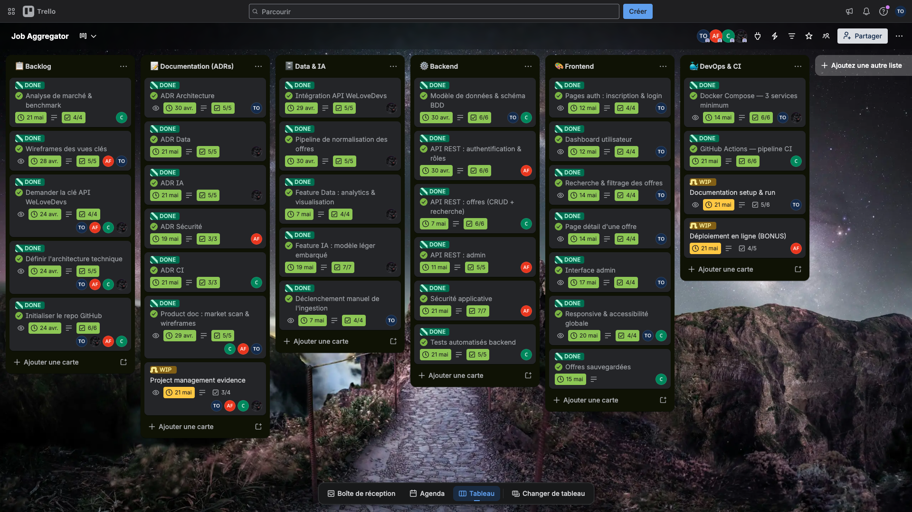

# Project Management

## Team

| Member                   | Role                     |
| ------------------------ | ------------------------ |
| Tom Ostermann            | Tech Lead / DevOps & CI  |
| Arthur Fabbri            | Backend & Data           |
| Christophe Rajaonarivoni | Frontend & Product       |
| Imran Nogueira           | Frontend & Documentation |

## Tracking Tool

We use Trello as our project management tool.
Board: https://trello.com/invite/b/69ce80d4d85dc15495858abd/ATTI44c7854914fa533edaf470f47795585bED4D7D07/job-aggregator

The board is organized into the following columns:
**Backlog / Documentation (ADRs) / Data & IA / Backend / Frontend / DevOps & CI**

Each card is assigned to one or more members and includes a checklist
tracking subtasks completion.

> Note: The team works Monday to Thursday, giving an effective
> 5-week sprint calendar between April 20 and May 21.

---

## Sprints

### Sprint 1 — Discovery & Product Foundation (20/04 → 24/04)

**Goal:** Understand the market, align on the product vision, and set up the project base.

| Task                                | Owner                   | Status  |
| ----------------------------------- | ----------------------- | ------- |
| Market analysis & benchmark         | Christophe              | ✅ Done |
| Identify user pain points           | Christophe              | ✅ Done |
| Define value proposition            | Christophe              | ✅ Done |
| Wireframes for key views            | Arthur, Tom             | ✅ Done |
| Define technical architecture       | Tom, Arthur, Christophe | ✅ Done |
| Initialize GitHub repository        | Tom, Arthur, Christophe | ✅ Done |
| Request WeLoveDevs API key          | Tom, Arthur, Christophe | ✅ Done |
| Initial task breakdown & assignment | All                     | ✅ Done |

---

### Sprint 2 — Core Implementation (28/04 → 08/05)

**Goal:** Build the data pipeline, core backend routes, and start documentation.

| Task                                    | Owner                   | Status  |
| --------------------------------------- | ----------------------- | ------- |
| WeLoveDevs API integration              | Arthur                  | ✅ Done |
| Offer normalization pipeline            | Arthur                  | ✅ Done |
| REST API: authentication & roles        | Arthur                  | ✅ Done |
| API REST: offers CRUD + search          | Christophe              | ✅ Done |
| Database schema & model                 | Arthur                  | ✅ Done |
| ADR Architecture                        | Tom                     | ✅ Done |
| Product doc: market scan & wireframes   | Christophe, Arthur, Tom | ✅ Done |
| Data feature: analytics & visualisation | Tom                     | ✅ Done |

---

### Sprint 3 — Frontend & Features (09/05 → 15/05)

**Goal:** Build the user-facing interface and integrate data/AI features.

| Task                                   | Owner           | Status  |
| -------------------------------------- | --------------- | ------- |
| Auth pages: register & login           | Arthur          | ✅ Done |
| User dashboard                         | Tom             | ✅ Done |
| Offer search & filtering               | Christophe      | ✅ Done |
| Offer detail page                      | Tom             | ✅ Done |
| Admin interface                        | Tom             | ✅ Done |
| Responsive & accessibility             | Tom, Christophe | ✅ Done |
| AI feature: lightweight embedded model | Arthur          | ✅ Done |
| Manual ingestion trigger               | Tom             | ✅ Done |
| REST API: admin                        | Arthur          | ✅ Done |
| Saved offers                           | Christophe      | ✅ Done |

---

### Sprint 4 — Security & CI (16/05 → 19/05)

**Goal:** Harden the platform, automate CI, and finalize DevOps setup.

| Task                        | Owner      | Status  |
| --------------------------- | ---------- | ------- |
| Application security        | Arthur     | ✅ Done |
| Backend automated tests     | Christophe | ✅ Done |
| GitHub Actions CI pipeline  | Christophe | ✅ Done |
| Docker Compose — 3 services | Tom        | ✅ Done |
| Documentation setup & run   | Tom        | ✅ Done |
| Online deployment (BONUS)   | Arthur     | ✅ Done |

---

### Sprint 5 — Documentation & Polish (20/05 → 21/05)

**Goal:** Finalize all ADRs, project management evidence, and prepare the final presentation.

| Task                           | Owner                   | Status  |
| ------------------------------ | ----------------------- | ------- |
| ADR Data                       | Arthur                  | ✅ Done |
| ADR IA                         | Arthur                  | ✅ Done |
| ADR Sécurité                   | Arthur                  | ✅ Done |
| ADR CI                         | Christophe              | ✅ Done |
| Project management evidence    | Tom, Arthur, Christophe | ✅ Done |
| Final presentation preparation | All                     | ✅ Done |

---

## Timeline Overview

```
20/04   24/04   08/05   15/05   19/05   21/05
  |-------|-------|-------|-------|-------|
  Sprint1  Sprint2  Sprint3  Sprint4  Sprint5
Discovery  Core    Frontend  Security  Docs &
& Setup   Impl.   & Features & CI     Polish
```

---

## Legend

- ✅ Done
- 🔄 WIP (Work In Progress)
- 📋 Todo

---

## Board Screenshot


